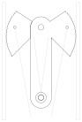
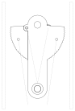

# Cam anchor

An anchor that you push up into the 80 mm gap between two ceiling beams,
where it sets itself against the beams' rough-sawn sides. You hang things
from it, such as a clothes-drying rod on cord. The more weight you hang on
it, the harder it grips. You take it out by pulling a trigger.

Four flat cams turn on one M6 bolt, which runs along the beams. Two cams
face each wall. They stack L R R L, so the grip is symmetric and the unit
can't twist. Two side plates carry that axle and, 80 mm below it, a second
M6 bolt inside a printed sleeve. The sleeve is the eye you hang the load
from.



This is the anchor set in the gap, looking along the beams. The walls, the
trigger cords and the rubber bands are dashed.

## How it holds

Each cam's working edge is a logarithmic spiral. Along a log spiral the
angle between the radius and the edge's normal is the same everywhere; here
it's α = 14°. So the cam meets the wall at the same angle whatever the width
of the gap: 14° below the axle's horizontal.

The wall's push on the cam has to pass through the axle. That means the
friction force must be at least N·tan α, where N is how hard the cam
presses on the wall. So the cam holds whenever the friction coefficient
exceeds tan 14° = 0.25. PETG on rough-sawn wood is about 0.4–0.5, which
gives roughly 2× margin.

A load on the eye pulls the axle down, and that turns each cam further out
against its wall. The anchor tightens itself. Each wall takes about
1 / (2 tan α) ≈ 2× the load, shared between its two cams: about 200 N per
wall at 10 kg. PETG with a steel axle carries that easily, and every load
stays in the printed plane.

Each cam is serrated. The tooth tips lie on the spiral, so the geometry
above still holds.


## Reach

| | reach per side | span | cam turn |
|---|---|---|---|
| retracted | 34 mm | 68 mm | 0° |
| set in an 80 mm gap | 40 mm | 80 mm | 37° |
| full reach | 45 mm | 90 mm | 64° |
| parked by the band (free air) | — | — | 74° |

That covers the 80 mm gap with ±10 mm to spare, for uneven or bowed beams.

## Strength

`mechanics.py` works out each failure mode at a load. Its default worst
case assumes only one cam per wall bears, because the beams are never flat
along their length. That cam then takes half the load as friction.

```
10 kg (98 N), 1 cam(s) bearing per wall: each carries F 49 N up, N 197 N into the wall, R 203 N on the axle
mode                    demand     limit      SF   fails at
slip (mu needed)         0.249       0.4     1.6          -
cam bearing               3.17        15     4.7      47 kg  MPa
axle bending               210       640     3.0      30 kg  MPa
eye bolt bending           142       640     4.5      45 kg  MPa
plate net tension        0.973        15    15.4     154 kg  MPa
plate shear-out          0.973      8.66     8.9      89 kg  MPa
plate bearing             2.68        15     5.6      56 kg  MPa
wall indent              0.982         5     5.1      48 kg  mm
rated load at SF 3: 10.1 kg
trigger pull with 5 N bands: up to 11 N
```

- **Slip** doesn't depend on the load. Its margin is μ / tan α, here 1.6,
  and it rests entirely on the friction estimate. `validate()` refuses
  tan α ≥ μ. If the cams slip in practice, lower `--alpha`: 12° gives 1.9
  but needs more cam turn for the same range.
- **The axle governs.** The M6 bolt is checked at its thread's minor
  diameter against the yield of class 8.8 steel. The biggest load on it
  isn't the weight. It's the cams' wall thrust N ≈ 2 W, which pushes in
  opposite directions on neighbouring cams and bends the bolt between
  them. Stacking L R R L keeps those opposed cams adjacent, and the worst
  case is one outer L cam and the far R cam bearing. With all four cams
  bearing, the axle's capacity rises to 44 kg.
- **Wall indent** is rough:
  - It takes softwood crushing across the grain at 2.5 MPa.
  - The teeth sink in first, then the spiral's rounded surface flattens.
  - Each mm of indent turns the cam further out, and it has 5 mm of reach
    left beyond the 80 mm gap.
- **The PETG parts** are checked against the 15 MPa creep ceiling used
  across this repo, not their short-term strength. The anchor holds its
  load indefinitely.

```
pixi run mechanics                       # the table above
just mechanics --load_kg 15 --cams_per_wall 2
```

`check()` refuses a load over the rated load.

## Trigger and spring

Each cam is a lever on the axle:

- **Trigger hole** (on the lobe). A cord is knotted through the hole and
  runs down the cam's face, in the washer gap beside it, to the
  finger-pull. Pulling the finger-pull retracts all four cams. The hole
  sits where the cord stays outboard of the axle over the whole working
  range, so it always has leverage.
- **Spring hole** (on the inboard arm). A rubber band runs from here down
  over the eye sleeve. It turns the cam outward until the spring hole comes
  directly above the sleeve. The band has no leverage there, so the cam
  stops without a hard stop, 10° past full reach.



Retracted by the trigger, the unit spans 68 mm.

## Parts

| part | print | notes |
|---|---|---|
| cam | 4 | flat; turn two over for the −x wall |
| side plate | 2 | flat |
| eye sleeve | 1 | upright |
| finger-pull | 1 | flat; tie both of one side's cords through that side's hole |
| M6 hole coupon | 1 | Ø 6.2 / 6.4 / 6.6, each labelled; print it first and set `--hole` to the best fit |

Hardware:
- M6 × 80 bolt and nylock nut (the axle; the stack is 56 mm, plus 12 mm of
  plates)
- M6 × 80 bolt and nut (the eye)
- 10 M6 washers: two in each gap, including between each outer cam and its
  plate
- about 1.5 m of 1–2 mm cord
- 2–4 rubber bands

## Assembly

1. Thread the axle through one plate, two washers, an L cam, two washers,
   an R cam, and so on (L R R L), then the other plate. Snug the nylock
   until the cams swing freely without wobbling.
2. Put the eye bolt through the plates and the sleeve.
3. Knot a cord through each cam's trigger hole. Run the two cords on each
   side down to that side's hole in the finger-pull, then even them up and
   tie them off with the cams retracted.
4. Loop rubber bands from each cam's spring hole down over the sleeve.
   Several bands, or one band doubled, give a firmer set.
5. Pull the finger-pull, push the anchor up into the gap, and let go.

## Use

```
pixi run parts          # stl/cam_a14_r34-45_x4.stl, plate, sleeve, finger_pull
pixi run render out.stl --part cam --alpha 12
just coupon             # stl/coupon_m6_holes.stl
pixi run preview        # the drawings above
pixi run test
```

| | default | flag |
|---|---|---|
| gap | 80 mm | `--gap` |
| friction (PETG on the walls) | 0.4 | `--mu` |
| cam angle | 14° | `--alpha` |
| reach per side | 34–45 mm | `--reach_min`, `--reach_max` |
| cam thickness | 10 mm | `--cam_t` |
| teeth | 0.8 mm deep, 2.5 mm pitch | `--tooth_d`, `--tooth_pitch` |
| axle to eye | 80 mm | `--drop` |
| plates | 24 × 6 mm | `--plate_w`, `--plate_t` |
| bolt holes | Ø 6.4 | `--hole` |

`validate()` refuses a cam that could slip (tan α ≥ μ), a reach range that
doesn't include the gap, plates wider than the retracted span, and lobes
that would hit the eye sleeve.

Every part prints flat, its profile on the bed, so every hole runs along
print Z.
