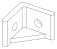

# Corner bracket

A right-angle bracket for two M8 bolts, one through each leg, with a
reinforcing rib in the inside corner along one edge.

In profile the bracket is an L drawn with a round pen: the L's centreline
dilated by half the thickness, so the leg ends and the outer corner are
rounded and nothing is left sharp. The inside corner, where brackets crack,
is filleted, and a 45° gusset fills the corner along one edge only, leaving
the rest of each leg's inside face clear for a bolt head and washer.




The second drawing is the print's footprint: the L, with the gusset's
triangle in the inside corner.

## Dimensions

| | default | flag |
|---|---|---|
| leg | 40 mm, from the other leg's outer face | `--leg` |
| thickness | 6 mm | `--thickness` |
| width | 30 mm, along the corner | `--width` |
| inside fillet | R3 | `--fillet_r` |
| rib | 25 mm along each leg from the inside corner, 5 mm of the width | `--rib_l`, `--rib_t` |
| holes | 8.6 mm (M8 clearance 8.4 + 0.2 print allowance) | `--hole_d` |
| hole position | 23 mm from the outer corner: midway along the leg's free length | `--hole_x` |
| washer | 16 mm (ISO 7089 M8), must clear the other leg, the leg's end and the rib | `--washer_d` |

The bolt heads sit on the legs' inside faces, so the bracket is refused if
the washer would foul the other leg, overhang the end of a leg, or land on
the rib. At the defaults the washer has 6 mm to spare before the other leg's
inside fillet, 9 mm before the leg's end, and 2 mm above the rib. `--label "..."` engraves an ID into the
print's top face.

## Use

```
pixi run bracket                               # stl/bracket_L40_t6_w30_r25x5_d8.6.stl
pixi run render out.stl --leg 50 --width 36
pixi run test
```

Print it on its side, as modelled: the L flat on the bed and the width as
the print's height. Every layer then runs round the whole corner, so the
bend is solid plastic rather than a stack of layer seams, and the gusset is
the first 5 mm of the print, growing straight off the bed.

The two holes run horizontally in that orientation and print as short round
bridges, as the usual parametric L-brackets do. They may come out a touch
oval at the top; run an 8.5 mm drill through if a bolt binds.
